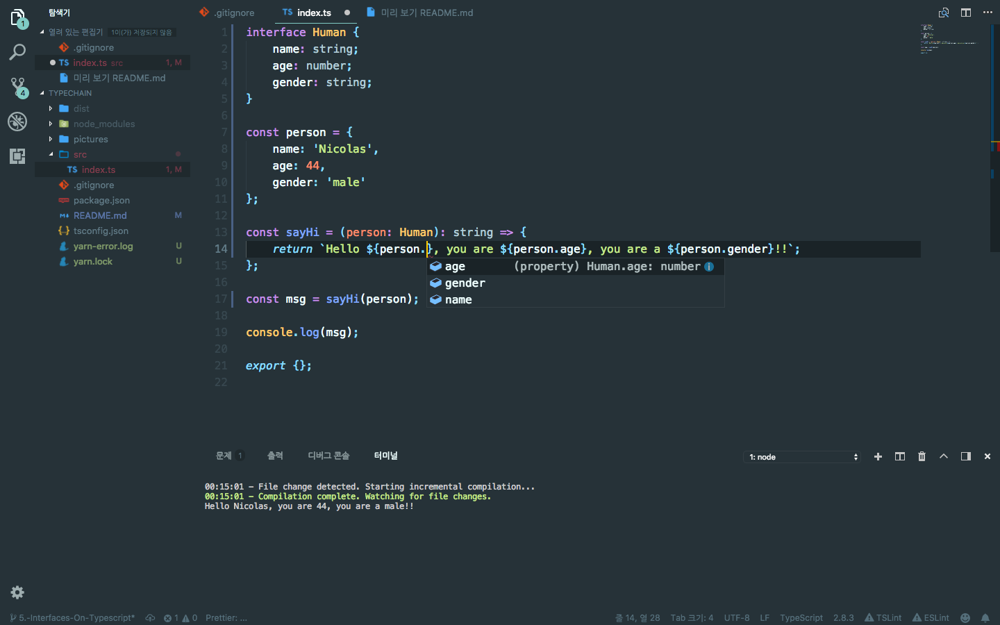

# Interface On Types

~~~
const person = {
	name: 'Nicolas',
	age: 44,
	gender: 'male'
};

const sayHi = ...;

const msg = sayHi(person);  // error

console.log(msg);

export {};
~~~
### 특정한 객체타입을 interface. 하나의 객체를 arg에 넘길 수 있게 된다.
~~~
interface Human {
    name: string,
    age: number,
    gender: string
}
~~~
인터페이스를 만들면 다음과 같이 쓸 수 있다.
~~~
const person = {
    ...
};

const sayHi = (person: Human): string => {
    return `Hello ${person.name}, you are ${person.age}, you are a ${person.gender}!!`;
}

const msg = sayHi(person);

...
~~~
### * assistance 가능

